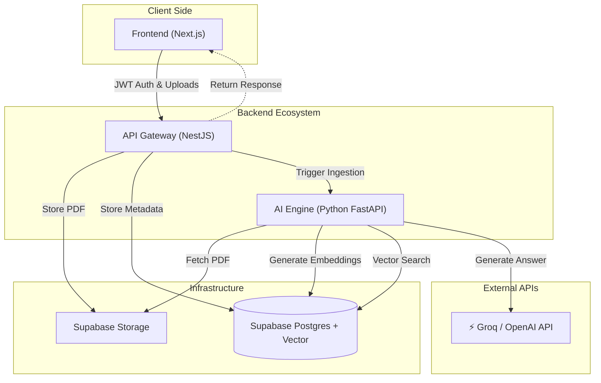

# Enterprise RAG Platform: Corporate Knowledge System

An enterprise-grade SaaS solution designed to allow secure querying of private internal documentation using **Retrieval-Augmented Generation (RAG)**.

Unlike public AI tools, this platform ensures data privacy by processing sensitive documents (PDFs) within a controlled microservices architecture, leveraging **Supabase (pgvector)** for semantic search and **NestJS** for robust role-based access control.

---

## 🏗️ System Architecture

This project implements a **Hybrid Microservices Architecture**. The design focuses on separating concerns: NestJS handles business logic and security, while Python handles high-performance vector processing.

The logic is finished; it is just necessary to deploy the servers (Nest and Python). You can test the RAG system using Postman or other similar tools to use the endpoints! 

You can find all the info of the key in the .env-sample! 
